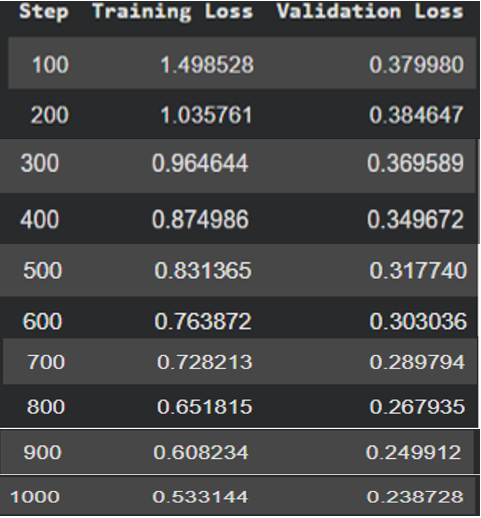

# Persian Whisper Optimization

[English](README.md) | [فارسی](README.fa.md)

Optimization, fine-tuning, and evaluation of **Whisper** models for Persian automatic speech recognition, with a focus on memory-efficient training using **LoRA and 8-bit quantization** and CPU inference with `whisper.cpp` and `OpenVINO`.

> This repository covers a multi-stage workflow: data preparation, fine-tuning, LoRA merging, model conversion and quantization, inference, and evaluation based on processing time and Word Error Rate (WER).

## Workflow Overview


## Project Goals

- Prepare the Persian Mozilla Common Voice dataset for Whisper
- Fine-tune `openai/whisper-large-v3-turbo` with LoRA
- Reduce training memory usage through 8-bit model loading
- Automatically resume training from the latest checkpoint
- Merge the LoRA adapter with the base model
- Convert the merged model to a `whisper.cpp`-compatible format
- Create a `Q8_0` quantized model for CPU inference
- Test an OpenVINO-based CPU inference pipeline
- Compare models using **Word Error Rate (WER)** and processing time

## Repository Structure

```text
persian-whisper-optimization/
├── notebooks/
│   ├── data_preparation.ipynb
│   ├── fine_tune_model.ipynb
│   ├── test.ipynb
│   └── whisper_ov_test.ipynb
├── results/
│   ├── loss.png
│   ├── whisper_fa_q8_test_results_colab_CPU.xlsx
│   ├── whisper_large_v3_turbo_test_results_colab_CPU.xlsx
│   └── whisper_ov_fp16_test_results_colab_CPU .xlsx
└── README.md
```

> Recommendation: remove the extra space before `.xlsx` in the OpenVINO result filename to prevent issues in links and scripts.

## Project Components

### 1. Data Preparation

The `notebooks/data_preparation.ipynb` notebook performs the following steps:

- Downloads the `hezarai/common-voice-13-fa` dataset
- Uses the `train`, `validation`, and `test` splits
- Resamples audio to `16 kHz`
- Extracts Whisper `input_features`
- Tokenizes Persian text and creates `labels`
- Saves the processed datasets to Google Drive using `save_to_disk`

Dataset sizes recorded in the notebook output:

| Split | Number of samples |
|---|---:|
| Train | 28,024 |
| Validation | 10,440 |
| Test | 10,440 |

### 2. Model Fine-Tuning

The `notebooks/fine_tune_model.ipynb` notebook fine-tunes the base model using **BitsAndBytes + LoRA**.

| Parameter | Value |
|---|---|
| Base model | `openai/whisper-large-v3-turbo` |
| Language / task | Persian / transcribe |
| Model loading | 8-bit |
| LoRA rank | `32` |
| LoRA alpha | `64` |
| Target modules | `q_proj`, `v_proj` |
| LoRA dropout | `0.05` |
| Batch size | `4` |
| Gradient accumulation | `4` |
| Effective batch size | `16` |
| Learning rate | `1e-3` |
| Maximum steps | `1000` |
| Evaluation interval | Every `100` steps |
| Checkpoint interval | Every `100` steps |
| Maximum saved checkpoints | `2` |
| Mixed precision | FP16 |

Training automatically resumes when a checkpoint is available. In the recorded run, checkpoints at steps `800` and `900` were detected, and training continued until step `1000`.

Latest values recorded in the training output:

| Step | Training loss | Validation loss |
|---:|---:|---:|
| 1000 | 0.533144 | 0.238728 |

### 3. Model Merging and Quantization

After training:

1. The LoRA adapter is merged with the base model.
2. The merged model is saved in Hugging Face format.
3. The model is converted to GGML using `whisper.cpp` tools.
4. A `Q8_0` version is generated for CPU inference.

Recorded quantization output:

| Model | Size |
|---|---:|
| Model before quantization | 3,085.62 MB |
| Q8_0 model | 833.08 MB |
| Size reduction | Approximately 73% |

The final model is created in the notebook with the following filename:

```text
whisper-fa-q8_0.bin
```

### 4. Model Evaluation

The `notebooks/test.ipynb` notebook expects a `mini_corpus.zip` archive containing a `clips` directory and a `validated.tsv` file. For each sample, it calculates and records:

- Reference transcription
- Predicted transcription
- Processing time
- WER

Results are saved in CSV/XLSX format. The notebook iterates over all rows in `validated.tsv`; the current files in the `results` directory contain 20 evaluation samples and one average row.

## Current Results

The values below were extracted directly from the files in the `results` directory. Lower WER is better.

| Model / format | Reported environment | Average time per file | Average WER |
|---|---|---:|---:|
| Persian fine-tuned Q8 | Colab CPU | 95.07 seconds | 78.90% |
| Whisper large-v3-turbo | Colab CPU | 45.40 seconds | 96.87% |
| OpenVINO FP16 | Colab CPU | 37.86 seconds | 94.69% |

In this small evaluation run, the fine-tuned Q8 model achieved the lowest WER but also had the slowest inference time. OpenVINO achieved the fastest average processing time among the three reported configurations.

### Loss Plot



## Installation

The notebooks were primarily developed for Google Colab.

```bash
pip install transformers datasets librosa evaluate jiwer gradio
pip install peft "bitsandbytes>=0.46.1" accelerate
pip install optimum optimum-intel openvino
```

For the evaluation notebook based on OpenAI Whisper:

```bash
pip install git+https://github.com/openai/whisper.git
pip install torchaudio jiwer
```

## Recommended Execution Order

1. Run `notebooks/data_preparation.ipynb`
2. Run `notebooks/fine_tune_model.ipynb`
3. Run the conversion and quantization cells at the end of the same notebook
4. Run `notebooks/test.ipynb` to evaluate the models
5. Run `notebooks/whisper_ov_test.ipynb` to test OpenVINO CPU inference

## Google Drive Paths

The Colab notebooks use the following directory structure:

```text
/content/drive/MyDrive/whisper_fa_dataset/
├── cache/
├── processed/
│   ├── train/
│   ├── validation/
│   └── test/
├── models/
├── final_lora_model/
├── merged_model/
└── gguf_models/
```

When moving the project to another location, update `BASE_DIR`, `PROCESSED_PATH`, `CHECKPOINT_DIR`, and all output paths accordingly.

## OpenVINO Inference

The `notebooks/whisper_ov_test.ipynb` notebook was written for a local Windows environment and contains absolute paths. Update the following values before running it:

```python
model_id = r"PATH_TO_HUGGINGFACE_MODEL"
save_dir = r"PATH_TO_OPENVINO_MODEL"
MODEL_PATH = r"PATH_TO_OPENVINO_MODEL"
AUDIO_PATH = r"PATH_TO_16KHZ_AUDIO.wav"
```

Example inference code:

```python
from optimum.intel.openvino import OVModelForSpeechSeq2Seq
from transformers import AutoProcessor
import librosa

processor = AutoProcessor.from_pretrained(MODEL_PATH)
model = OVModelForSpeechSeq2Seq.from_pretrained(MODEL_PATH, device="CPU")

audio, _ = librosa.load(AUDIO_PATH, sr=16000)
inputs = processor(
    audio,
    sampling_rate=16000,
    return_tensors="pt"
).input_features

predicted_ids = model.generate(inputs)
text = processor.batch_decode(predicted_ids, skip_special_tokens=True)[0]
print(text)
```
